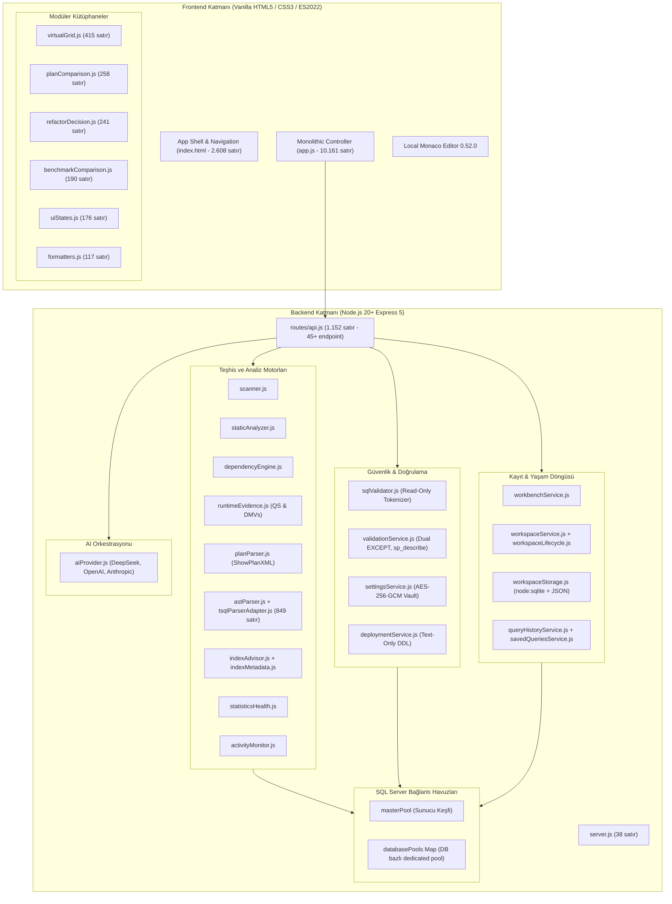
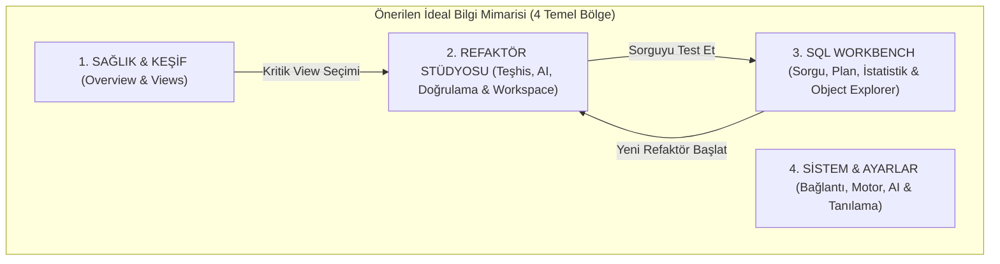
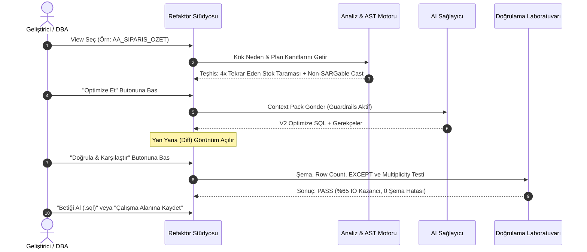

# SQL Server Refactoring & Performance Studio
## Master Functional, UX & Product Audit

**Doküman Sürümü:** v1.0.0 (Kapsamlı Sistem Denetimi)  
**Tarih:** 22 Eylül 2026  
**Denetlenen Sürüm:** v0.8.0-beta (`origin/main`, commit `b747dd1`)  
**Denetim Kapsamı:** Mimari, Backend, Frontend, UX/UI, Güvenlik, İşlevsellik, Bilgi Mimarisi ve Kod Tabanı  
**Kural:** Bu denetim salt-okunur (read-only) gerçekleştirilmiştir; kod tabanında doğrudan hiçbir değişiklik yapılmamıştır.

---

## 1. Executive Summary

SQL Server Refactoring & Performance Studio (SQL Studio), karmaşık kurumsal ERP sistemlerinde (özellikle Mikro ERP gibi 600+ `AA_%` view birikimine sahip ortamlarda) view katmanlarını, bağımlılık zincirlerini, Query Store/plan regresyonlarını haritalamak, performans darboğazlarını kök neden seviyesinde teşhis etmek ve kontrollü AI destekli refaktör önerileri üretmek amacıyla geliştirilmiş **ileri düzey bir SQL Server Teşhis ve Refaktör İstasyonudur**.

Proje, geleneksel bir "web dashboard" veya basit bir "ChatGPT wrapper" olmanın çok ötesine geçmiştir. Kod tabanında derinlemesine inşa edilmiş AST ayrıştırıcı, ShowPlan XML operatör ayrıştırıcısı, çok katmanlı semantik doğrulama motoru (`sp_describe_first_result_set`, dual `EXCEPT`, `GROUP BY` multiplicity), bağımsız veritabanı havuz yöneticisi ve yerel SQLite/JSON çalışma alanı depolaması yer almaktadır.

Bununla birlikte, peş peşe tamamlanan 8 sprintlik yoğun geliştirme süreci üründe **ciddi bir mimari bölünmeye ve bilişsel yük patlamasına (cognitive overload)** yol açmıştır:

1. **Ürün Kimliği Çatallanması:** Ürün, başlangıçtaki *"View Refactoring & Performance Troubleshooter"* kimliğinden çıkıp aynı anda hem bir *SQL IDE (SSMS/DataGrip rakibi)*, hem bir *Canlı DBA Monitörü*, hem bir *İndeks Danışmanı*, hem bir *Proje/Çalışma Alanı Yönetim Sistemi* olmaya çalışmaktadır.
2. **Kullanıcı Akışının Parçalanması:** Bir view'ın sorununu bulup düzeltmek için kullanıcının 4 farklı ekranda (View Detail → AI Refactor → Validation Lab → Workspaces) mekik dokuması gerekmektedir. Tek bir görev çok sayıda ekrana ve sekmeye bölünmüştür.
3. **Frontend Monolitliği (God-File):** `public/assets/js/app.js` dosyası **10.161 satıra**, `public/assets/css/app.css` ise **6.791 satıra** ulaşmıştır. Bu durum hata ayıklamayı, test edilebilirliği ve ekip içi paralel geliştirmeyi zorlaştırmaktadır.
4. **Skor ve Durum Yorgunluğu (Score/Status Fatigue):** Sistemde 7 farklı skor (Health, Risk, Severity, Benefit, Confidence, Similarity, Opportunity) ve onlarca durum rozeti (badge) kullanıcıya aynı anda sunulmakta, bu da verinin alarm etkisini zayıflatmaktadır.
5. **Görsel & Dil Tutarsızlıkları:** Kurumsal T-SQL mühendislik terminolojisi ile Türkçe arayüz metinleri yer yer birbirine karışmakta (Refaktör / Refactor, Çalışma Alanı / Workspace), emoji ve süslemeler profesyonel araç ciddiyetini yer yer zedelemektedir.

Aşağıdaki denetim, projenin güçlü mühendislik temellerini korurken, onu dünya standartlarında kurumsal bir masaüstü/web teşhis istasyonuna dönüştürecek stratejik yol haritasını sunmaktadır.

---

## 2. Product Identity

### 2.1 Ürün Esasen Nedir?
Kaynak kodun (`server/services/`, `public/assets/js/`, SQL şablonları) analizi neticesinde ürünün gerçek çekirdeği:

> **Cevap: D + C (Performans Kök Neden Teşhisi ve Güvenli Refaktör Platformu)**

Ürün bir genel amaçlı DBA izleme aracı (SolarWinds/Redgate Monitor) değildir; genel amaçlı bir SQL sorgulama editörü (SSMS/DBeaver) de değildir. Ürünün benzersiz ve pazarda eşi olmayan değeri şudur:
**"SQL Server üzerindeki iç içe geçmiş, ağır ve verimsiz View/Sorgu yapılarını haritalamak, çalışma zamanı kanıtlarıyla yavaşlığın sebebini bulmak, güvenli bir alternatif SQL üretmek ve bu alternatifi veritabanına dokunmadan matematiksel olarak doğrulamak."**

### 2.2 Kimlik Tutarlılığı ve "Her Şeyi Yapan Araç" Tuzağı
Sprint 7 ve 8 ile birlikte eklenen SQL Workbench (Monaco editörü, çoklu sonuç kümeleri, sanal tablo ızgarası) ve Sprint 5 ile eklenen Canlı Aktivite Monitörü (`sys.dm_exec_requests`, Blocking Tree, Wait Stats), ürünü tehlikeli bir şekilde **"SSMS klonu"** olmaya itmiştir.

| Boyut | Hedeflenen Değer | Mevcut Durum | Risk Derecesi |
|---|---|---|---|
| **Ana Odak** | View/Query Refactoring & Performance | 13 ana menü, SQL IDE, Canlı Kilit Monitörü | **YÜKSEK** (Odak Dağılması) |
| **Workbench Rolü** | Refaktör doğrulama ve ad-hoc test aracı | Bağımsız devasa bir IDE | **ORTA** (Bilişsel Yük) |
| **DBA Araçları** | View etki alanı analizi | Genel sunucu kilit/bekleme izleme | **ORTA** (Yüzeysel İzleme) |

**UX Maliyeti:** Kullanıcı uygulamayı açtığında ne yapması gerektiğini anlayamamakta; "Ben buraya sorgu mu yazmaya geldim, kilitlenen oturumları mı öldüreceğim, yoksa view mı optimize edeceğim?" sorusuyla karşı karşıya kalmaktadır.

---

## 3. Architecture Map

### 3.1 Katmanlı Mimari Şeması



### 3.2 Modül Fonksiyon Haritası
- **`server.js`**: Sunucu başlatıcı, çevrimdışı Monaco statik bağlayıcısı (`/vendor/monaco/vs`), `/api` route bağlayıcısı ve SPA fallback yönlendiricisi.
- **`routes/api.js`**: 45'in üzerinde REST endpoint'i barındıran merkezi denetleyici. Şifre sızıntısını engelleyen `handleSafeError` sarıcısına sahiptir.
- **`services/sqlServer.js`**: Sunucu seviyesinde `sys.databases` keşfi yapan `masterPool` ve her aktif veritabanı için ayrık `ConnectionPool` tutan havuz yöneticisi.
- **`services/sqlValidator.js`**: Çalıştırılmak istenen SQL'deki yorumları ve string literallerini temizleyip ilk token'ın `SELECT` veya `WITH` olduğunu, yasaklı anahtar kelimelerin (`INSERT`, `UPDATE`, `DELETE`, `DROP`, `EXEC`, `INTO`, `XP_`) bulunmadığını denetleyen uygulama düzeyi kalkan.
- **`services/runtimeEvidence.js`**: Query Store (veya plan cache fallback) üzerinden çalışma zamanı metriklerini çeken, regresyon tespit eden, kanıt derecelendiren (Grade A/B/C) motor.
- **`services/planParser.js`**: ShowPlanXML çıktısını hiyerarşik RelOp operatör ağacına dönüştüren, maliyet yüzdelerini ve kardinalite sapmalarını hesaplayan ayrıştırıcı.
- **`services/ast/`**: Harici C# veya harici binary bağımlılığı olmadan saf JavaScript ile T-SQL sorgularını ayrıştıran recursive AST motoru.
- **`services/workspaceStorage.js`**: Node.js 22+ yerleşik `node:sqlite` (`DatabaseSync` WAL mod) veya atomik JSON dosya yazımı kullanan, şifreleri asla diske yazmayan yerel depolama katmanı.

---

## 4. Feature Inventory (Tüm Ekran ve Yetenekler)

| Modül | Amaç | Ana Kullanıcı | Kullanıcı Girdisi | Üretilen Çıktı | Bağlı Olduğu Motorlar | Kullanım Sıklığı | UX Karmaşıklığı | Gerçek Değer | Eksikler / Sorunlar |
|---|---|---|---|---|---|---|---|---|---|
| **Genel Bakış (Overview)** | Sistem sağlığını ve kritik acil durumları özetlemek | Tüm roller | Yok (Tarama butonları) | DB Health, Kritik View listesi, Trendler | `scanner`, `scoring`, `runtimeEvidence` | Çok Yüksek | Orta | **Yüksek** | Zaman serisi grafiği boş/mock; kartlar fazla süslü; doğrudan aksiyon butonu az |
| **View Envanteri** | Taranan tüm view'ları listelemek ve filtrelemek | Developer, DBA | Filtre, arama, DB seçimi | Puanlı view tablosu, risk rozetleri | `metadataCatalog`, `scanner` | Çok Yüksek | Düşük | **Çok Yüksek** | Kolon sayısı fazla; sayfalamasız 600 satır DOM yükü oluşturabilir |
| **View Detay (9 Sekme)** | Bir view'ın tüm anatomisini incelemek | Developer, Perf. Eng. | Tab tıklamaları, filtreler | SQL, Graph, Plan, İndeks, Sorunlar, AI | Tüm backend motorları | Çok Yüksek | **Çok Yüksek** | **Çok Yüksek** | 9 sekme arasında bağlam kopuyor; AI sekmesi ile ana AI ekranı mükerrer |
| **Bağımlılık Haritası** | İki yönlü bağımlılık zincirini görselleştirmek | Developer, Architect | Node seçimi, derinlik, arama | SVG interaktif graph, etki alanı | `dependencyEngine` | Orta | Yüksek | **Yüksek** | Vis.js/Cytoscape yerine custom SVG kullanılmış; 100+ node'da yavaşlayabilir |
| **Regresyon & Süre** | Query Store anomalilerini incelemek | Perf. Eng., DBA | Zaman penceresi (1h-30d) | Regresyon listesi, süre/IO deltaları | `runtimeEvidence` | Yüksek | Orta | **Çok Yüksek** | View Detay'daki Runtime sekmesiyle neredeyse birebir örtüşüyor |
| **Tablo Baskısı** | En çok yük binen fiziksel tabloları bulmak | DBA, Perf. Eng. | Tablo seçimi | Tekrar eden erişim yolları | `scanner`, `dependencyEngine` | Düşük | Düşük | **Orta** | Bağımsız ekran olmak yerine View Envanteri altında bir alt filtre olmalı |
| **Mükerrer Mantık** | Kopya/benzer SQL sorgularını tespit etmek | Architect, Dev | Benzerlik eşiği | Normalleştirilmiş fingerprint kümeleri | `duplicateFinder` | Düşük | Düşük | **Orta** | Salt view analizi; inline table fonksiyonları kapsamıyor |
| **AI Refaktör** | Yavaş view için alternatif optimize SQL üretmek | Developer, DBA | Optimizasyon kuralları | Açıklamalı V2 SQL adayı, AST karşılaştırma | `aiProvider`, `astAnalyzer` | Yüksek | **Çok Yüksek** | **Çok Yüksek** | Aday panelinde 6 iç sekme var; Validation Lab'a veri aktarımı kafa karıştırıcı |
| **Doğrulama Lab** | Aday SQL'i semantik ve süre açısından sınamak | Developer, QA | Orijinal ve Aday SQL, örneklem limiti | PASS/FAIL kararı, EXCEPT sonucu, Multiplicity | `validationService` | Yüksek | Yüksek | **Kritik** | Başarılı olunca "Şimdi ne yapmalıyım?" sorusunun yanıtı eksik |
| **Refactor Result** | Before/After plan ve IO karşılaştırması | Perf. Eng. | Workspace veya test adayı | Delta tablosu, operatör karşılaştırması | `planComparison`, `refactorDecision` | Yüksek | Yüksek | **Yüksek** | AI ekranı içine gömülmüş; bağımsız bir onay adımında olmalı |
| **Workspaces** | Refaktör sürümlerini, kanıtları ve geçmişi yönetmek | Lead Dev, DBA | Proje adı, onay/ret notları | Değişmez doğrulama/benchmark kanıtları, DDL script | `workspaceService`, `workspaceStorage` | Orta | Yüksek | **Yüksek** | Bürokratik hissettiriyor; tek kişilik ekipler için fazla ağır kalıyor |
| **SQL Workbench** | Ad-hoc SQL sorgulamak, plan çekmek, test etmek | SQL Dev, DBA | T-SQL sorgusu, DB seçimi | Sanal tablo ızgarası, Plan, Mesajlar, İstatistikler | `workbenchService`, `monacoLocator` | Çok Yüksek | Yüksek | **Yüksek** | SSMS ile rekabet etmeye çalışıyor; `SET NOCOUNT` gibi komutlarda takılıyor |
| **İndeks & İstatistik** | Eksik indeks ve bayat istatistikleri denetlemek | Senior DBA | Tablo/DB filtreleri | Fayda puanlı indeks önerileri, STALE listesi | `indexAdvisor`, `statisticsHealth` | Orta | Orta | **Yüksek** | View odaklı ürünün yanında genel sunucu aracı gibi duruyor |
| **Canlı Aktivite & Kilit** | Anlık kilitlenen oturumları ve beklemeleri izlemek | Senior DBA | Yenileme aralığı | Hiyerarşik Kilit Ağacı, Wait Stats | `activityMonitor` | Düşük-Orta | Orta | **Orta** | İzleme var ama `KILL` yetkisi yok (doğru guardrail ama DBA için eksik hissettiriyor) |
| **Ayarlar & Tanılama** | Sistem, puanlama, tema ve AI anahtarlarını yönetmek | Tüm kullanıcılar | API key, ağırlıklar, tema | Şifrelenmiş konfigürasyon, JSON diagnostic | `settingsService` | Düşük | Düşük | **Zorunlu** | Puanlama ağırlıkları ayarı çok detaylı; ortalama kullanıcı için kafa karıştırıcı |

---

## 5. User Personas

### Persona A: Orta Seviye SQL / Planlama Çalışanı (ERP ERP Sorumlusu)
- **Kullanacağı Ekran:** Overview → View Envanteri → AI Hızlı Teşhis.
- **Zorlanacağı Ekran:** AST Analizi, ShowPlanXML Operatör Kırılımları, Multiplicity Group By mantığı.
- **Gereksiz Bulacağı Ekran:** Canlı Kilit Ağacı, İstatistik Modifikasyon Sayaçları.
- **Kritik İhtiyacı:** *"Raporum 4 dakikadır dönmüyor, hangi tablo yüzünden takıldığını tek tıkla Türkçe görmek istiyorum."*
- **Kafa Karıştıran Terimler:** SARGable, Cardinality Mismatch, Dual EXCEPT, Hash Spool, Subtree Cost.

### Persona B: Senior SQL Developer
- **Kullanacağı Ekran:** View Detay (SQL/Plan) → AI Refaktör → Validation Lab → SQL Workbench.
- **Zorlanacağı Ekran:** Yok; ancak akışın 4 ekrana bölünmesinden dolayı zaman kaybeder.
- **Gereksiz Bulacağı Ekran:** 5 adımlı Onboarding Sihirbazı, dekoratif sağlık puanı dairesi.
- **Kritik İhtiyacı:** Yan yana (diff) SQL editörü, anlık execution plan karşılaştırması, klavye kısayolları (F5, Ctrl+Enter, Ctrl+L).

### Persona C: Senior SQL Server DBA
- **Kullanacağı Ekran:** Index Advisor, Statistics Health, Runtime Regression, Plan Warnings.
- **Zorlanacağı / Şüphe Duyacağı Ekran:** AI Refaktör (AI'ın ürettiği sorguya doğası gereği güvenmez).
- **Gereksiz Bulacağı Ekran:** Temel tablo baskı sayfası (bunu zaten DMV'lerden bilir).
- **Kritik İhtiyacı:** Kesin kanıt (Evidence Grade A), sıfır veritabanı mutasyonu garantisi, `DROP/ALTER` yapılmayacağının taahhüdü, indeks DML yazma maliyeti uyarısı.

### Persona D: İlk Kez Kullanan Teknik Kullanıcı
- **Kullanacağı Ekran:** Onboarding Sihirbazı → Overview.
- **Zorlanacağı Nokta:** Sol menüde 13 farklı buton görmek, nereye tıklayacağını bilememek.
- **Kritik İhtiyacı:** Net bir "Başlangıç Turu" veya "Önce bunu yapın" yönlendirmesi.

---

## 6. Information Architecture Audit

### 6.1 Mevcut Menü Yapısı Analizi
Mevcut sol kenar çubuğu (Sidebar) 5 ana grup altında 13 sayfadan oluşmaktadır:
- **GENEL:** Genel Bakış (1)
- **ANALİZ:** View Envanteri (2), Bağımlılık Haritası (3), Regresyon & Süre (4), Tablo Baskısı (5), Mükerrer Mantık (6)
- **OPTİMİZASYON:** AI Refaktör (7), Doğrulama Lab (8), Çalışma Alanları (9)
- **SQL ARAÇLARI:** SQL Workbench (10), İndeks & İstatistik (11), Canlı Aktivite & Kilit (12)
- **SİSTEM:** Ayarlar & Tanılama (13)

### 6.2 Tespit Edilen Yapısal Kusurlar
1. **Aşırı Menü Kalabalığı (13 Ekran):** Bir masaüstü veya yerel web aracı için 13 ekran bilişsel yorgunluk üretmektedir.
2. **Parçalanmış Refaktör Süreci:** AI Refaktör (sayfa 7), Doğrulama Lab (sayfa 8) ve Çalışma Alanları (sayfa 9) aslında **tek bir mühendislik sürecinin ardışık 3 adımıdır**. Kullanıcı bu üçü arasında kaybolmaktadır.
3. **Mükerrer Ekranlar:** 
   - *Regresyon & Süre* sayfası, *View Detay* içerisindeki *Çalışma Zamanı* sekmesiyle %80 aynı veriyi göstermektedir.
   - *Tablo Baskısı* sayfası, *Bağımlılık Haritası* ve *İndeksler* ile iç içe geçmiştir. Bağımsız bir tam sayfa olmayı hak etmemektedir.
4. **SQL Workbench'in Konumu:** Workbench "SQL Araçları" altında ikincil bir araç gibi sunulmaktadır. Oysa geliştirici için en sık açılacak operasyon yüzeyidir.

---

## 7. Core User Journeys & "3-Click" Audit

### Akış A: Performans Darboğazı Teşhisi ve Düzeltme
- **Mevcut Yol:** Overview → View Envanteri (tık 1) → View Seçimi (tık 2) → Plan Sekmesi (tık 3) → Kök Neden Oku (tık 4) → "Refaktör Et" butonuna bas (tık 5 - sayfa değişir) → AI Aday Oluştur (tık 6) → Adayı Doğrulama Lab'a Gönder (tık 7 - sayfa değişir) → Doğrula butonuna bas (tık 8) → Benchmark Çalıştır (tık 9) → Çalışma Alanına Kaydet (tık 10 - modal açılır).
- **Değerlendirme:** **10 Adım / 4 Farklı Sayfa Geçişi.** Korkunç derecede parçalanmış bir akış. Kullanıcı bağlamı (context) kaybetmektedir.
- **İdeal Hedef:** **3-4 Adım.** View Seç → Teşhisi Gör → Tek Pencereli Stüdyoda Refaktör & Doğrula → Kaydet.

### Akış B: Ad-Hoc Sorgu ve Hızlı Plan İnceleme
- **Mevcut Yol:** Workbench'e tıkla (1) → Sorguyu yapıştır/yaz → "Tahmini Plan" butonuna tıkla (2) → Alt sekmeden "Çalıştırma Planı" sekmesine geç (3) → Operatörleri incele.
- **Değerlendirme:** **3 Tık.** Bu akış oldukça başarılı ve hızlıdır.

### Akış C: "3 Tık" Kriter Analiz Tablosu

| Hedef Görev | Mevcut Tık Sayısı | Kabul Edilebilir mi? | Darboğaz / Neden Fazla? |
|---|---|---|---|
| En riskli view'ı bulmak | 1 tık | **EVET (Mükemmel)** | Overview üzerindeki risk listesinden doğrudan seçilebiliyor |
| Bir view'ın execution planını görmek | 3 tık | **EVET** | View Envanteri → View Seç → Plan Sekmesi |
| AI Refaktör başlatmak | 4 tık | **HAYIR** | View Detay'dan AI sayfasına zıplama ve parametre seçimi gerektiriyor |
| Adayı semantik doğrulamak | 6 tık | **HAYIR** | AI ekranından SQL kopyalama veya Lab'a aktarma butonu arama karmaşası |
| Benchmark karşılaştırması yapmak | 7 tık | **HAYIR** | Validation Lab içinde ayrı bir alt buton dizisi |
| Kilitlenen oturumu (Head Blocker) görmek | 1 tık | **EVET** | Sol menüden Aktivite sayfasına girildiği anda en üstte çıkıyor |
| Eksik indeksi tespit edip scriptini almak | 2 tık | **EVET** | İndeks sayfasına git → "Script Oluştur" butonuna bas |

---

## 8. Screen-by-Screen Audits

### 8.1 Overview (Genel Bakış) Audit
- **Güçlü Yönler:** DB Health dairesi ve kritik view kartları ilk 3 saniyede genel durumu anlatıyor. "Bugün Müdahale Edilecekler" listesi risk sırasına göre sıralı.
- **Kusurlar:**
  - "Zaman Serisi Analizi" kartı boş bir mock durumundadır (`Zaman Serisi Verisi Henüz Mevcut Değil`).
  - Metrik kartlarındaki küçük trend metinleri (`+4 bugün`, `94 pattern`) statik mock hissi vermektedir.
  - "Analiz Akışı" (Activity feed) gerçek bir SQL Server denetim günlüğü değil, statik kurallarla üretilmiş simüle olaylardır.
- **Öneri:** Feed ve boş zaman serisi kaldırılmalı; yerine "Doğrulanmış ve Dağıtıma Hazır Refaktörler" ile "En Çok I/O Harcayan 5 View" widget'ı konulmalıdır.

### 8.2 View Envanteri & View Detay Audit
- **Güçlü Yönler:** Sol listede anlık arama (⌘K), risk filtresi (`all`, `critical`, `high`) ve veritabanı seçicisi çok akıcı çalışmaktadır.
- **Kusurlar:**
  - View Detay paneli **9 sekmeden** oluşmaktadır (`Genel Bakış`, `SQL`, `Bağımlılıklar`, `Çalışma Zamanı`, `Planlar`, `İndeksler`, `Sorunlar`, `AI Refaktör`, `Geçmiş`).
  - *Sorunlar* sekmesi ile *Genel Bakış* sekmesindeki bulgular birbirini tekrar etmektedir.
  - *AI Refaktör* sekmesine tıklandığında kullanıcı sol menüdeki bağımsız *AI Refaktör* sayfasına yönlendirilmekte (`data-goto="refactor"`), bu da sayfa içi sekme mantığıyla çelişmektedir.
- **Öneri:** 9 sekme 4 mantıksal gruba indirilmelidir: **1. Teşhis & Kök Neden (Overview + Sorunlar + Plan), 2. SQL & Bağımlılık (SQL + Graph), 3. Çalışma Zamanı Kanıtı (Runtime + İndeks), 4. Refaktör Stüdyosu (AI + Doğrulama).**

### 8.3 AI Refactor UX Audit
- **Güçlü Yönler:** Semantik Guardrail kutusu (`Sözleşme kuralları denetleniyor`) ve token bütçesi denetimi (`estimateAndPruneTokenBudget`) backend'de mükemmel kurgulanmıştır. Asla veritabanı mutasyonuna izin verilmemektedir.
- **Kusurlar:**
  - AI Refaktör ekranı açıldığında altında beliren *Candidate Panel* kendi içinde 6 alt sekmeye ayrılmaktadır (`deep`, `analysis`, `sql`, `split`, `compare`, `ast`). Bu, ekran içinde ekran yaratmaktadır.
  - "Hızlı Teşhis", "Derinlemesine Analiz Et" ve "Aday Refaktör Oluştur" butonları arasındaki fark kullanıcı için belirsizdir. Kullanıcı hangisine basması gerektiğini bilememektedir.
  - AI öneri açıklamaları bazen gereksiz uzundur; doğrudan SQL diff'e odaklanmayı engellemektedir.
- **Öneri:** "Hızlı Teşhis" doğrudan view detayına gömülmeli; AI Refactor butonuna basıldığında tek bir bölünmüş ekran (Orijinal SQL vs Optimize SQL) ve altında 3 temel doğrulama adımı açılmalıdır.

### 8.4 Validation Lab Audit
- **Güçlü Yönler:** SQL Server dünyasında benzeri görülmemiş bir matematiksel titizlik vardır. DUAL `EXCEPT` sorgusunun duplicate satırları yutma riskine karşı `GROUP BY ... COUNT_BIG(*)` multiplicity testi eklenmiştir. `sp_describe_first_result_set` ile şema kontrolü kusursuzdur.
- **Kusurlar:**
  - Test sonucu `PASS_WITH_WARNING` çıktığında kullanıcı "Bu ne demek? Canlıya alabilir miyim?" tereddüdü yaşamaktadır.
  - Doğrulama başarılı olduktan sonra "Çalışma Alanına Kaydet" veya "Script Üret" adımı ikincil butonlarla gizlenmiştir.
- **Öneri:** Doğrulama sonuç kartında büyük bir "Sonraki Adım" yönlendirmesi olmalıdır: *Örn: "Doğrulama Tamamlandı → Benchmark Testine Geç veya Dağıtım Betiği Üret".*

### 8.5 SQL Workbench Audit (SSMS & DataGrip Perspektifi)
- **Güçlü Yönler:**
  - Monaco editörü yerel/offline çalışmaktadır.
  - `virtualGrid.js` sayesinde 10.000 satırlık sonuçlar 60 FPS akıcılıkta kaydırılmaktadır.
  - TSV kopyalama (Hücre, Seçili Satırlar, Başlıklarla Kopyala) ve Excel uyumlu UTF-8 BOM CSV dışa aktarımı mevcuttur.
  - `SET STATISTICS IO/TIME` çıktıları hem ham konsol olarak hem de "Anlamlı Türkçe Özet" kartları olarak sunulmaktadır.
  - Gerçek zamanlı sorgu iptali (`request.cancel()`) çalışmaktadır.
- **Kusurlar / Eksikler:**
  - **`SET NOCOUNT ON` Kısıtı:** `sqlValidator.js` yalnızca ilk kelimesi `SELECT` veya `WITH` olan sorgulara izin verdiği için, bir geliştirici alışkanlıkla `SET NOCOUNT ON; SELECT ...` yazdığında sorgu doğrudan engellenmektedir. Bu, kıdemli SQL geliştiricileri için çok sinir bozucu bir hatadır.
  - **Grid Sütun Boyutlandırma (Column Resizing):** Tablo başlıkları manuel olarak fareyle genişletilememektedir; uzun metinler kesilmektedir.
  - **Hiyerarşik Object Explorer Yok:** Sol tarafta veritabanındaki tabloları ve kolonları gösteren bir ağaç yapısı bulunmamaktadır. Kullanıcı tablo adını ezbere bilmek zorundadır.

### 8.6 Index Advisor & Statistics Health Audit
- **Güçlü Yönler:**
  - İndeks önerileri körü körüne yapılmamakta; `CLUSTERED_KEY_COVERAGE`, `DUPLICATE`, `INCLUDE_EXPANSION_CANDIDATE` gibi mevcut indeks çakışmaları analiz edilmektedir.
  - DML yazma maliyeti ve geniş include uyarısı verilmektedir.
  - İstatistiklerde `rowmodctr / rows` oranı 1.0'ı aştığında bar %100'de kilitlenmekte ve "Satır sayısının X katı kadar değişiklik birikmiş" şeklinde açıklanmaktadır.
- **Kusurlar:**
  - Bu iki ekran tek bir sayfada (`page-indexes`) toplanmış olsa da görsel olarak birbirinden kopuk iki büyük tablo halindedir.
  - Bir view incelenirken o view'ın kullandığı tabloların indeks eksikleri View Detay ekranından doğrudan görünmemektedir.

### 8.7 Activity Monitor Audit
- **Güçlü Yönler:** Kilit ağacında `HEAD_BLOCKER` (Kilidin başı) ile `BLOCKED_SESSION` ayrımı net yapılmıştır. Döngüsel kilitlenme (deadlock cycle) uyarısı vardır.
- **Kusurlar:** Salt-okunur politika gereği haklı olarak `KILL` butonu yoktur; ancak bir DBA için "Kilit olduğunu gördüm, peki kim bu kullanıcı, host adı ne, IP'si ne?" bilgisi yetersiz kalmaktadır.

---

## 9. Design System, UI & Visual Language Audit

### 9.1 Görsel Dil & Profesyonellik Değerlendirmesi
Uygulama genel görünüm olarak:

> **Değerlendirme: B+ (Gelişmiş Geliştirici Aracı ile Aşırı Süslenmiş Web Dashboard Arasında Bir Hibrit)**

Uygulama Linear ve DataGrip esintileri taşıyan çok kaliteli bir koyu tema paletine (`--bg-canvas: #090a0f`, mor ve camgöbeği vurgular) ve yakın zamanda eklenen başarılı bir açık temaya (`premium-light.css`) sahiptir. Ancak kurumsal bir SQL Server aracında olmaması gereken bazı görsel fazlalıklar vardır:
- **Cam Efektleri ve Arka Plan Paraziti:** `noise` sınıfı ve aşırı kart gölgeleri düşük donanımlı Windows istemcilerinde GPU/CPU tüketebilir.
- **Emoji Enflasyonu:** Arayüzün dört bir yanında dağınık emojiler kullanılmaktadır: 🌳, 📊, ✦, ⚡, 🛡️, 🔬, 📋, 🔌, 🚀, 💾, 🗺. Bu emojiler kurumsal sistem yöneticileri ve DBA'lar gözünde ürünü "öğrenci projesi" veya "prototip" gibi göstermektedir.
- **Aşırı Geniş Kartlar (Metric Padding):** Overview sayfasındaki 7 metrik kartı çok fazla dikey alan kaplamaktadır.

### 9.2 Veri Yoğunluğu (Data Density)
SSMS ve DataGrip gibi araçlar milimetrik piksel verimliliğine odaklanır. SQL Studio'da ise satır yükseklikleri (`--row-height: 44px`) ve kart içi boşluklar (`--card-padding: 18px`) web standartlarına göre konforlu, ancak 600 view ve 50 kolonla uğraşan bir veritabanı mühendisi için **fazla ferahtır (low density)**.
- **Öneri:** Arayüz ayarlarına gerçek bir "Kompakt Mod" (Kompakt: 26px satır yüksekliği, 12px font) eklenmeli; varsayılan görünüm profesyonel SQL araçları yoğunluğuna çekilmelidir.

### 9.3 Renk ve Anlamsal Tutarlılık (Color Semantics)
- **Kırmızı (`--red` / `#ff5d72`):** Yalnızca `CRITICAL`, `FAIL` ve `BLOCKER` durumlarında kullanılmış, kurala sadık kalınmıştır.
- **Sarı/Turuncu (`--yellow`, `--orange`):** `HIGH`, `WARNING`, `STALE` durumlarında kullanılmıştır.
- **Yeşil (`--green` / `#43d99c`):** `PASS`, `HEALTHY` durumlarında kullanılmıştır.
- **Mor (`--purple` / `#7c5cff`):** AI ve özel marka aksiyonları için ayrılmıştır. Tutarlıdır.
- **Sorun:** Bazı badge'lerde metin rengi ile arka plan kontrastı açık temada (Light Mode) sınırda kalmaktadır (`WCAG AA` kontrast kontrolü gerektirmektedir).

---

## 10. Copywriting & Terminology Audit

### 10.1 Türkçe / İngilizce Karışıklığı
Kod tabanında ve arayüzde ciddi bir terminoloji ikiliği bulunmaktadır:
- Bir yerde **"Refaktör"**, başka bir yerde **"Refactor"**.
- Bir yerde **"Çalışma Alanı"**, başka bir yerde **"Workspace"**.
- Bir yerde **"İndeks"**, başka bir yerde **"Index Advisor"**.
- Bir yerde **"Regresyon"**, başka bir yerde **"Regression & Süre"**.
- Bir yerde **"Doğrulama Lab"**, başka bir yerde **"Validation Stüdyosu"**.

### 10.2 Standart Terminoloji Sözlüğü Önerisi

| Mevcut Karışık Kullanım | Standartlaşmış Terim (Önerilen) | Gerekçe |
|---|---|---|
| Refactor / Refaktör | **Refaktör** | Türkçe teknik dilde kabul görmüş yazım |
| Workspace / Çalışma Alanı | **Çalışma Alanı (Workspace)** | İlk kullanımda ikisi, menüde "Çalışma Alanları" |
| Validation Lab / Doğrulama Stüdyosu | **Doğrulama Laboratuvarı** | Resmi ve teknik ciddiyet |
| Index Advisor | **İndeks Danışmanı** | Anlaşılır Türkçe |
| Statistics Health | **İstatistik Sağlığı** | Anlaşılır Türkçe |
| Execution Plan / Çalıştırma Planı | **Yürütme Planı** | Microsoft resmi SQL Server Türkçe çevirisi |
| Logical Reads | **Mantıksal Okuma (Reads)** | Teknik doğruluk |
| Drift Detection | **Şema Kayması (Drift)** | İki terimin birlikte verilmesi |

---

## 11. Backend & API Architecture Audit

### 11.1 Güçlü Mimari Kararlar
1. **Çoklu Veritabanı Havuz Güvenliği (`sqlServer.js`):** Havuzlu bağlantılarda asla `USE [db]` komutu çalıştırılmamakta; her veritabanı için ayrık bir `ConnectionPool` örneği yönetilmektedir. Bu, bağlantı sızıntısını ve veritabanı bağlamı karışıklığını tamamen önler.
2. **Hassas Veri Maskeleme (`sanitizeError`, `redactSensitiveSql`):** Hata mesajlarında ve loglarda bağlantı şifreleri, API anahtarları regex ile filtrelenmektedir.
3. **Değişmez Kanıt Zinciri (`workspaceLifecycle.js`):** Aday SQL'in SHA-256 özeti alınmakta; SQL metninde tek bir boşluk değişse dahi önceki doğrulama ve benchmark kanıtları otomatik olarak `STALE` durumuna düşürülmektedir.

### 11.2 Zayıf Noktalar & Teknik Borç
1. **Monolitik API Dosyası (`routes/api.js` - 1.152 satır):** Tüm route'lar tek bir dosyada toplanmıştır. Auth, connection, scan, ai, validation, workbench, workspaces gibi bağımsız modüller router katmanında ayrıştırılmalıdır (`routes/workbench.js`, `routes/workspaces.js`, vb.).
2. **Hata Yakalama Tekdüzeliği:** API hatalarının çoğu `res.status(400).json({ ok: false, error: ... })` döndürmektedir. 404 (Not Found), 403 (Forbidden), 504 (Timeout) gibi standart HTTP durum kodları nadiren kullanılmaktadır.
3. **Bellek İçi Önbellek Yönetimi:** `astParser.js` ve `metadataCatalog.js` içindeki Map nesneleri uzun süreli sunucu çalışma durumunda hafıza şişmesine (memory leak) yol açabilir.

---

## 12. Frontend Architecture & God-File Audit

### 12.1 `app.js` Kırılımı (10.161 Satır!)
`public/assets/js/app.js` projenin en büyük bakım ve sürdürülebilirlik riskidir. İçerisindeki sorumluluk dağılımı şöyledir:

```
app.js (10.161 satır)
 ├── 001 - 330 : Global State, Breadcrumbs, Toast, Genel Yardımcılar
 ├── 331 - 472 : Bağlantı Durumu & Modal Tetikleyicileri
 ├── 473 - 797 : Overview Sayfası & Kart Güncellemeleri
 ├── 798 - 1525: View Envanteri & 9 Sekmeli Detay Paneli Render Fonksiyonları
 ├── 1526 - 2381: Bağımlılık Grafiği (SVG Pan, Zoom, Sürükle-Bırak, Arama Motoru)
 ├── 2382 - 2550: Tablo Baskısı Sayfası
 ├── 2551 - 2651: Mükerrer Mantık Sayfası
 ├── 2652 - 2872: Regresyon & Çalışma Zamanı Sayfası
 ├── 2873 - 3346: Ayarlar Ekranı Denetleyicisi (Scoring weights, AI, Theme)
 ├── 3347 - 3430: Tarama Koordinatörü & İlerleme Çubuğu
 ├── 3431 - 3727: 2 Adımlı Sunucu Bağlantı Sihirbazı
 ├── 3728 - 4922: AI Refaktör Motoru & Dinamik View İnceleme Arayüzü
 ├── 4923 - 5402: Refaktör Karşılaştırma & Plan X-Ray Paneli (Sprint 3)
 ├── 5403 - 5616: T-SQL AST & İndeks Kapsam Stüdyosu (Sprint 4)
 ├── 5617 - 5990: Doğrulama Laboratuvarı & Kıyaslama Kontrolcüsü
 ├── 5991 - 6195: Komut Paleti (Ctrl+K)
 ├── 6196 - 8335: SQL Workbench Tam Denetleyicisi (Monaco, Tablar, Grid, Mesajlar)
 ├── 8336 - 8644: Canlı Aktivite, Kilit ve Bekleme Ekranı
 ├── 8645 - 8814: İndeks Danışmanı & İstatistik Sağlığı
 ├── 8815 - 9880: Çalışma Alanları (Workspaces) CRUD & Onay Yaşam Döngüsü
 └── 9881 - 10161: Klavye Kısayolları & 5 Adımlı Onboarding Sihirbazı
```

### 12.2 Değerlendirme & Framework Tartışması
- **React / Vue Geçişi Yapılmalı mı?**
  **KESİNLİKLE HAYIR.** Kullanıcı kuralı açıktır (Vanilla JS). Ürünün Vanilla JS kalması hafifliğini, Windows'ta `Baslat.bat` ile anında açılabilmesini ve sıfır build step (Webpack/Vite gerektirmeme) avantajını sağlamaktadır.
- **Doğru Çözüm:** `app.js` dosyasını bir framework'e dönüştürmek yerine, hali hazırda `public/assets/js/modules/` altında başlatılan modüler yapıya sadık kalarak mantıksal alt kontrolcülere (ES modülleri veya script parçaları) bölmektir (`controllers/workbenchController.js`, `controllers/refactorController.js`, vb.).

---

## 13. SQL Server Safety & Defense-in-Depth Audit

Proje `AGENTS.md` içerisindeki "Zero Database Mutation" kuralına uymak için çok katmanlı bir savunma mekanizması kurmuştur.

### 13.1 Savunma Katmanları
1. **Katman 1 (Uygulama İçi Regex & Tokenizer):** `sqlValidator.js` tüm yorumları ve stringleri temizler. Sadece `SELECT` ve `WITH` sorgularına izin verir. 30'dan fazla yasaklı DDL/DML anahtar kelimesini engeller.
2. **Katman 2 (Bağlantı İzolasyonu):** Kullanıcı şifreleri sunucu belleğinde tutulur; istemciye asla gönderilmez. Diske yazılırken AES-256-GCM ile şifrelenir.
3. **Katman 3 (Salt-Metin Dağıtım Paketi):** `deploymentService.js` üretilen iyileştirilmiş SQL'i veritabanında `ALTER VIEW` olarak çalıştırmaz. Sadece kopyalanabilir bir `.sql` betiği olarak ekrana verir.
4. **Katman 4 (AI Guardrail):** AI sistem komutlarında DDL/DML önermesi yasaklanmıştır; sadece salt-okunur `SELECT` sorgusu üretmesi kurala bağlanmıştır.

### 13.2 En Zayıf Halka (Weakest Link)
> **Zayıf Nokta:** Uygulama seviyesindeki `sqlValidator.js` bir T-SQL derleyicisi (compiler) değildir.  
> Örneğin: `SET TRANSACTION ISOLATION LEVEL READ UNCOMMITTED; SELECT ...` gibi masum bir komut dahi ilk kelimesi `SET` olduğu için engellenmektedir. Buna karşın çok karmaşık iç içe geçmiş veya dinamik SQL çağrılarında regex tabanlı token doğrulayıcılar teorik olarak atlatılabilir.
> 
> **Gerçek Güvenlik Kuralı:** SQL Server tarafında bağlantı kullanıcısına `db_datareader` ve `VIEW SERVER STATE` dışında **HİÇBİR YETKİ (özellikle `db_datawriter`, `db_ddladmin` veya `sysadmin`) VERİLMEMELİDİR.** En güçlü kalkan her zaman SQL Server'ın kendi güvenlik motorudur.

---

## 14. Top 20 UX Issues

| No | Sorun (Issue) | Ekran | Kullanıcı Etkisi | Neden Kaynaklanıyor? | Önem Derecesi | Çözüm Yönü |
|---|---|---|---|---|---|---|
| **UX-01** | Parçalanmış Refaktör Akışı | Refactor, Validation, Workspaces | Kullanıcı 4 ekran arasında kayboluyor | Her sprintte yeni bir ekran eklenmesi | **BLOCKER** | Tek sayfada 3 adımlı sihirbaz (Analiz → Doğrula → Kaydet) |
| **UX-02** | View Detay'da 9 Sekme Karmaşası | View Detail | Bilgiye ulaşmak için sürekli sekme değiştirmek gerekiyor | Tüm motor çıktılarının ayrık sekmelere konulması | **HIGH** | 9 sekmeyi 4 ana panelle konsolide et |
| **UX-03** | `SET NOCOUNT` Engeli | SQL Workbench | Kıdemli SQL geliştiricileri sorgu çalıştıramıyor | İlk kelimenin katı `SELECT/WITH` kontrolü | **HIGH** | `SET NOCOUNT ON/OFF` komutunu güvenli whitelist'e al |
| **UX-04** | Boş Zaman Serisi Kartı | Overview | Güven kaybı ("Bu araç çalışmıyor mu?") | Query Store zaman serisi motorunun yarım kalması | **HIGH** | Veri yoksa kartı gizle veya gerçek Query Store trendini bağla |
| **UX-05** | Aşırı Emoji Kullanımı | Tüm Arayüz | Kurumsal ciddiyeti azaltıyor, amatör hissi veriyor | Sprintlerde eklenen dekoratif ikonlar | **MEDIUM** | Emojileri temizle; profesyonel SVG/monokrom ikonlara geç |
| **UX-06** | Aday Panelinde İç Sekmeler (6 Tab) | AI Refactor | Ekran içinde ekran, kaydırma çubuğu karmaşası | AST, Diff, X-Ray'in hepsinin alt alta konulması | **HIGH** | Yan yana (Side-by-Side) temiz bir diff yüzeyi oluştur |
| **UX-07** | "Sonraki Adım Ne?" Belirsizliği | Validation Lab | Doğrulama başarılı olunca kullanıcı duraksıyor | Birincil yönlendirici buton (CTA) eksikliği | **HIGH** | Yeşil "Çalışma Alanına Kaydet ve Script Üret" butonu ekle |
| **UX-08** | Grid Sütun Genişletme Yok | SQL Workbench | Uzun veri tipleri ve metinler okunamıyor | VirtualGrid'de resize tutamaçlarının olmaması | **MEDIUM** | Tablo başlıklarına sürükle-bırak genişletme ekle |
| **UX-09** | Object Explorer Yokluğu | SQL Workbench | Tablo ve kolon adlarını hatırlamak zorunda kalınıyor | Workbench'in bağımsız editör gibi tasarlanması | **MEDIUM** | Sol tarafa daraltılabilir bir şema/tablo ağacı ekle |
| **UX-10** | Mükerrer Ekranlar (Tablo Baskısı) | Tables | Gereksiz menü kalabalığı | Bağımsız sayfa olarak tasarlanması | **MEDIUM** | Sayfayı kaldır, View Envanteri filtresi haline getir |
| **UX-11** | Skor Yorgunluğu | Overview, Views | Hangi puanın ne anlama geldiği anlaşılmıyor | 7 farklı skor metriğinin bir arada sunulması | **HIGH** | Health ve Risk olarak 2 temel skorda sadeleş |
| **UX-12** | Belirsiz 3 AI Butonu | AI Refactor | Kullanıcı Hızlı mı, Derin mi seçeceğini bilmiyor | Fonksiyonların ayrıştırılamaması | **MEDIUM** | Tek bir "Analiz Et & Optimize Et" butonunda birleştir |
| **UX-13** | Onboarding 5 Adım Fazlalığı | İlk Kurulum | Kullanıcı bir an önce araca girmek istiyor | AI yapılandırmasının ilk adıma zorlanması | **MEDIUM** | 2 adıma indir (Bağlan → Tara), AI ayarını sonraya bırak |
| **UX-14** | Terminoloji İkiliği | Genel | Bazen İngilizce bazen Türkçe terimler kafa karıştırıyor | Çeviri standardı olmaması | **MEDIUM** | Tekil Türkçe teknik sözlük uygula |
| **UX-15** | Düşük Bilgi Yoğunluğu | Genel | Ekranda çok az veri görünüyor, boşluk çok | Fazla padding ve satır yükseklikleri | **MEDIUM** | Profesyonel Kompakt Görünüm modunu varsayılan yap |
| **UX-16** | Simüle Aktivite Akışı | Overview | Gerçek olmayan verinin güveni sarsması | Statik olayların "canlı feed" gibi sunulması | **LOW** | Gerçek veritabanı tarama geçmişiyle değiştir |
| **UX-17** | Haritada Manuel Düzenleme Eksikliği | Dependency Graph | Düğümler üst üste binebiliyor | Basit SVG koordinat hesaplayıcısı | **MEDIUM** | Otomatik layout algoritmasını güçlendir veya Cytoscape'e geç |
| **UX-18** | Kayıtlı Sorgularda Arama Kısıtı | SQL Workbench | 50+ sorguda aradığını bulmak zor | Modal içinde basit liste gösterimi | **LOW** | Arama kutusu ve etiketleme (tagging) ekle |
| **UX-19** | Bildirim (Toast) Yığılması | Genel | Arka arkaya hata veya bilgi pencereleri birikiyor | Global toast kuyruk yöneticisi olmaması | **LOW** | Maksimum 3 toast göster, eskileri otomatik kapat |
| **UX-20** | Kapatılamayan Koyu/Açık Kontrast Hataları| Settings | Bazı butonlar açık temada soluk kalıyor | CSS değişkenlerinin yer yer ezilmesi | **MEDIUM** | `premium-light.css` kontrast testini tamamla |

---

## 15. Top 20 Functional & Engineering Issues

| No | Sorun | Dosya / Modül | Teknik Risk / Açıklama | Önem | Çözüm Yönü |
|---|---|---|---|---|---|
| **FN-01** | `SET NOCOUNT` ve Session Option Reddi | `sqlValidator.js` | `SET NOCOUNT ON; SELECT ...` yazıldığında sorgu engelleniyor | **CRITICAL** | İlk komut regex'inde zararsız session komutlarına izin ver |
| **FN-02** | Monolitik Controller (10k satır) | `public/assets/js/app.js` | Hata ayıklama imkansızlaşıyor, test yazılamıyor | **HIGH** | Mantıksal alt denetleyicilere parçala (Vanilla JS kalarak) |
| **FN-03** | Monolitik API Router (1.1k satır) | `server/routes/api.js` | Tüm endpoint'lerin tek dosyada olması | **MEDIUM** | `routes/` altında alt router'lara ayır |
| **FN-04** | Bellek Sızıntısı Riski (AST Cache) | `services/ast/astParser.js` | `MAX_CACHE_SIZE = 2000` Map üzerinde LRU tam işletilmezse şişebilir | **MEDIUM** | Gerçek bir LRU eviction kütüphanesi veya mantığı ekle |
| **FN-05** | Fast-XML-Parser DOM Fallback Farkı | `services/planParser.js` | Fallback parser bazı derin ShowPlan namespace'lerini kaçırabilir | **MEDIUM** | Fallback parser'ı derin XML testleriyle doğrula |
| **FN-06** | Query Store Zaman Serisi Eksikliği | `public/assets/js/app.js` | Overview'daki zaman serisi kartı backend'e bağlı değil | **HIGH** | `runtimeEvidence.js` içindeki timeseries verisini arayüze bağla |
| **FN-07** | VirtualGrid Yatay Kaydırma Eşitlemesi | `virtualGrid.js` | 50+ sütunlu sonuçlarda sticky header ile body piksel kayması | **MEDIUM** | Scroll senkronizasyon event'ini `requestAnimationFrame` ile bağla |
| **FN-08** | LOB Kolonlarında Validasyon İptali | `validationService.js` | `VARCHAR(MAX)` veya `XML` içeren view'larda multiplicity hesaplanamıyor | **MEDIUM** | LOB tipleri için `CHECKSUM` / `HASHBYTES` fallback'i ekle |
| **FN-09** | Çift Tırnaklı Identifier Uyuşmazlığı | `sqlValidator.js` | `QUOTED_IDENTIFIER` kapalı ortamlarda çift tırnak string sanılabilir | **LOW** | SQL Server oturum ayarlarında `SET QUOTED_IDENTIFIER ON` zorla |
| **FN-10** | Drift Detection Süre Aşımı | `workspaceService.js` | 600 view'lık ortamda drift kontrolü tüm view'ları yeniden çekiyor | **HIGH** | Sadece aktif çalışma alanındaki hedef view'ın hash'ini kontrol et |
| **FN-11** | Multi-DB Havuz Kapanış Sızıntısı | `services/sqlServer.js` | Sunucu bağlantısı kesilirken havuzların `close()` çağrısı beklemede kalabilir | **MEDIUM** | `Promise.allSettled` ile tüm havuzları zaman aşımlı kapat |
| **FN-12** | Transaction İçi Estimated Plan | `workbenchService.js` | `SET SHOWPLAN_XML ON` transaction içinde çalıştırılıp rollback ediliyor | **LOW** | ShowPlan zaten sorgu çalıştırmaz; transaction yükü gereksizdir |
| **FN-13** | AI API Yanıt Süresi (Timeout) | `services/aiProvider.js` | 30 saniye timeout büyük view'larda DeepSeek için yetersiz kalabilir | **MEDIUM** | Timeout süresini ayarlardan dinamik (30s-120s) yapılabilir kıl |
| **FN-14** | Sayfalamasız View Listesi | `public/assets/js/app.js` | 2000+ view içeren bir ERP'de DOM'a aynı anda 2000 kart basılırsa tarayıcı donar | **HIGH** | View Envanteri sol listesine sanal liste (virtual scroll) ekle |
| **FN-15** | Cross-Database View Bağımlılıkları | `dependencyEngine.js` | Farklı DB'deki tablolara başvuran (`DB2.dbo.Tablo`) referanslar eksik çözülebilir | **MEDIUM** | 3-part ve 4-part isim çözümleme mantığını güçlendir |
| **FN-16** | Missing Index Script Tekilleştirme | `indexAdvisor.js` | Aynı tablo için birden fazla benzer eksik indeks önerisi üretilebiliyor | **LOW** | Aday indeksleri birbiriyle merge eden optimizasyon kuralı koy |
| **FN-17** | Activity Monitor Yetki Çökmesi | `activityMonitor.js` | Kullanıcının `VIEW SERVER STATE` yetkisi yoksa sayfa patlayabilir | **HIGH** | Yetki yoksa zarifçe hata verip "Yetki Eksik" durumuna düşür |
| **FN-18** | SQLite / JSON Depolama Yarışı | `workspaceStorage.js` | JSON fallback modunda iki eşzamanlı yazma durumunda veri kaybı riski | **MEDIUM** | Dosya kilitleme (file locking) mekanizmasını doğrula |
| **FN-19** | Puanlama Ağırlık Sıfırlama Tutarsızlığı | `settingsService.js` | Skor ağırlıkları sıfırlandığında önbellekteki taranmış view puanları güncellenmiyor | **LOW** | Ayar değişince envanter skorlarını arka planda yeniden hesapla |
| **FN-20** | Windows Dosya Yolu Kaçışları | `monacoLocator.js` | Ters eğik çizgi (`\`) bazı Windows sürümlerinde URL path'inde sorun yapabilir | **LOW** | Tüm dosya yollarını `/` formatına normalize et |

---

## 16. Top 10 Design & Visual Issues

1. **Aşırı Geniş Dashboard Kartları:** KPI kartları ekranda çok fazla dikey yer kaplıyor; asıl kritik tablo aşağıya kayıyor.
2. **Dekoratif Parazit (Noise Background):** Performans aracında CSS parazit efekti kurumsal görünümle uyuşmuyor.
3. **Emoji Kirliliği:** Buton ve sekme başlıklarında metin yerine emoji kullanılması ciddiyeti zedeliyor.
4. **Cam Efekti (Glassmorphism):** Arka plan bulanıklığı ve yarı saydamlık bazı eski monitörlerde okunabilirliği düşürüyor.
5. **Dengesiz Buton Hiyerarşisi:** Aynı ekranda 4 farklı "Primary" (mor/mavi) buton yan yana durabiliyor. Hangisinin ana aksiyon olduğu belli değil.
6. **Yetersiz Tablo Başlığı Kontrastı:** Açık temada tablo başlıkları (`th`) arka planla neredeyse aynı renkte kalıyor.
7. **Monaco ve Textarea Geçiş Çirkinliği:** Monaco yüklenene kadar veya fallback durumunda textarea fontu ve satır numaraları uyumsuz görünüyor.
8. **Çok Fazla Font Boyutu Varyasyonu:** CSS içinde 10'dan fazla farklı font boyutu token'ı var; tipografik ritim bozuluyor.
9. **Modal Genişlik Uyumsuzluğu:** Bazı modallar dar (400px), bazıları aşırı geniş (95vw); ekran tutarlılığı zayıf.
10. **Aşırı Canlı Yeşil ve Kırmızı Tonları:** Koyu temadaki `#ff5d72` ve `#43d99c` uzun süre bakıldığında gözü yoruyor.

---

## 17. Top 10 Things Done Exceptionally Well

1. **Benzersiz Ürün Değeri:** SQL Server ekosisteminde iç içe geçmiş view'ları bağımlılık ve çalışma zamanı kanıtıyla haritalayan başka bir hafif araç yoktur.
2. **Sıfır Veritabanı Mutasyonu Garantisi:** Canlı veritabanında hiçbir zaman DDL/DML çalıştırmaması, DBA'ların araca güven duymasını sağlıyor.
3. **Multiplicity Destekli Semantik Doğrulama:** `EXCEPT` sorgusunun duplicate satır körlüğünü `COUNT_BIG(*)` ile aşması muhteşem bir veritabanı mühendisliği başarısıdır.
4. **Bağımsız Veritabanı Bağlantı Havuzları:** `USE [db]` çalıştırmayıp her veritabanına dedicated pool açılması kurumsal standartta bir mimaridir.
5. **AES-256-GCM Şifrelenmiş Yerel Kasa:** Şifrelerin asla istemciye verilmemesi ve yerel dosyada makineye bağlı şifrelenmesi mükemmel bir güvenlik yaklaşımıdır.
6. **Değişmez Kanıt Zinciri (SHA-256):** Aday SQL değiştiğinde eski doğrulama ve benchmark kanıtlarının anında geçersiz kılınması sahte başarı raporlarını engeller.
7. **ShowPlanXML Operatör Kırılımı:** C# veya harici binary olmadan saf Node.js üzerinde XML planının operatör operatör ayrıştırılması büyük bir başarıdır.
8. **VirtualGrid Performansı:** 10.000 satırlık sonuçların DOM'u kilitlemeden akıcı bir şekilde kaydırılması ve Excel uyumlu BOM CSV çıktısı çok başarılıdır.
9. **Tamamen Çevrimdışı Monaco Desteği:** Dış dünyaya kapalı kurumsal ortamlarda Monaco editörünün CDN olmadan yerel diskten servis edilmesi harika bir karardır.
10. **İndeks Çakışma Analizi (Conflict Engine):** Sadece "şu indeksi aç" demeyip, mevcut Clustered veya Disabled indekslerle çakışmayı denetlemesi çok olgun bir DBA yaklaşımıdır.

---

## 18. User-Friendliness & Functional Maturity Scorecards

### 18.1 Kullanıcı Dostuluğu Puan Tablosu (User-Friendliness - 100 Üzerinden)

| Alan | Puan | Gerekçe (1-2 Cümle) |
|---|---|---|
| **İlk Kullanım (First Time Use)** | **68** | Onboarding sihirbazı var ancak 5 adım fazla uzun; kullanıcı neyle karşılaşacağını baştan tam kestiremiyor. |
| **Gezinme (Navigation)** | **62** | 13 ana menü öğesi çok kalabalık; görevler arası geçişlerde sol menüde nereye gideceğini bulmak zor. |
| **Bilgi Mimarisi (IA)** | **58** | AI Refaktör, Doğrulama ve Çalışma Alanları 3 ayrı sayfaya bölünmüş; akış parçalanmış durumda. |
| **SQL Workbench** | **78** | Editör ve sonuç ızgarası çok iyi, ancak `SET NOCOUNT` kısıtı ve object explorer eksikliği puan kırıyor. |
| **Performans Teşhisi** | **84** | Plan uyarıları, kardinalite sapmaları ve kök neden bulguları mükemmel derecede anlaşılır sunuluyor. |
| **AI Refaktör Deneyimi** | **65** | Aday panelinde 6 iç sekme bulunması kafa karıştırıyor; "Hızlı" ve "Derin" analiz farkı net değil. |
| **Doğrulama (Validation)** | **72** | Teknik olarak kusursuz çalışıyor ancak PASS sonrası kullanıcıya sunulan eylem yönlendirmesi zayıf. |
| **Çalışma Alanları (Workspaces)** | **64** | Yaşam döngüsü çok katı ve bürokratik; tek kişilik hızlı incelemeler için fazla ağır hissettiriyor. |
| **DBA Sağlık Araçları** | **76** | İndeks danışmanı ve istatistik analizi çok zengin; kilit ağacında oturum öldürme olmaması anlaşılabilir. |
| **Hata Yönetimi (Error UX)** | **74** | Şifre sızıntısı engellenmiş, ancak bazı hatalarda sadece hata kodu verilip çözüm önerisi sunulmuyor. |
| **Görsel Tasarım (Visual Design)** | **75** | Renk paleti ve temalar kaliteli; ancak parazit efektleri ve dağınık emojiler ciddiyeti düşürüyor. |
| **Veri Yoğunluğu (Data Density)** | **63** | Kartlar ve boşluklar web sitesi gibi fazla ferah; profesyonel bir SQL aracının yoğunluğuna sahip değil. |
| **Tutarlılık (Consistency)** | **66** | Türkçe-İngilizce terminoloji ikiliği ve aynı butonun farklı sayfalarda farklı stillerde olması tutarsız. |
| **Erişilebilirlik (A11y)** | **60** | Klavye kısayolları var ancak açık temada bazı buton kontrastları ve aria etiketleri eksik. |
| **Belgelendirme & Yardım** | **80** | F1 kısayol modalı ve kod içi dokümantasyon çok güçlü. |
| **GENEL UX OLGUNLUĞU** | **69 / 100** | **Teknik yetenekleri çok güçlü, ancak bilişsel yükü yüksek ve akışları parçalanmış bir uzman aracı.** |

### 18.2 İşlevsel Olgunluk Puan Tablosu (Functional Maturity - 100 Üzerinden)

| Alan | Puan | Gerekçe |
|---|---|---|
| **SQL Analizi (AST & Heuristic)** | **88** | Regex yerine yerleşik T-SQL parser kullanılması ve CTE/Apply analizi çok olgun. |
| **Çalışma Zamanı Kanıtı (Runtime)** | **90** | Query Store ve DMV entegrasyonu, kanıt derecelendirmesi (Grade A/B/C) sektör standardında. |
| **Query Store Entegrasyonu** | **86** | Zaman aralıkları ve regresyon formülleri çok sağlam; sadece frontend grafik bağı eksik. |
| **Yürütme Planı Analizi** | **92** | ShowPlanXML'in saf JS ile RelOp seviyesinde ayrıştırılması ve maliyet hesabı mükemmel. |
| **AI Bağlam Paketi (Context Pack)** | **89** | Token bütçeleme, şema sıkıştırma ve semantik guardrail yönetimi çok başarılı. |
| **Doğrulama (Validation)** | **94** | Dual EXCEPT + Multiplicity kontrolü kurumsal seviyede güven veriyor. |
| **Benchmark Motoru** | **85** | Çoklu çalıştırma (3-10 run) ve medyan süre/IO ölçümü güvenilir sonuç üretiyor. |
| **İndeks Danışmanı** | **88** | Çakışma tespiti, DML risk uyarısı ve benefit skoru çok iyi kurgulanmış. |
| **İstatistik Sağlığı** | **87** | `rowmodctr` analizi ve STALE tespiti gerçek DBA ihtiyaçlarına hitap ediyor. |
| **Canlı Aktivite & Kilit** | **78** | Kilit ağacı ve bekleme istatistikleri doğru çalışıyor, kümülatif uyarısı yerinde. |
| **SQL Workbench** | **82** | Sanal tablo, Monaco ve formatlama harika; session komut desteği iyileştirilmeli. |
| **Kalıcılık (Persistence)** | **90** | `node:sqlite` + JSON fallback hibriti çok dayanıklı ve sıfır bağımlılıklı. |
| **Dağıtım Güvenliği (Safety)** | **96** | Asla veritabanı mutasyonu yapmaması ve script-only çıktı üretmesi kusursuz. |
| **Test Kapsamı** | **88** | 24 test dosyası ve 15 test süiti motorları derinlemesine sınıyor. |
| **Güvenlik (Secret Hygiene)** | **95** | Bellek içi şifre tutma, AES-256 kasa ve sanitize error katmanları eksiksiz. |
| **GENEL İŞLEVSEL OLGUNLUK** | **88 / 100** | **Arka plan motorları prodüksiyon seviyesinde güçlü, güvenilir ve deterministiktir.** |

---

## 19. Overengineering & Score Fatigue Audit

### 19.1 Aşırı Mühendislik Yapılmış (Overengineered) Alanlar
1. **7 Kademeli Aday Paneli:** AI ekranındaki `deep`, `analysis`, `sql`, `split`, `compare`, `ast` sekmeleri gereksiz bir hiyerarşi oluşturmaktadır. Kullanıcı sadece "Eski SQL", "Yeni SQL" ve "Doğrulama Durumu" görmek istemektedir.
2. **Bürokratik Çalışma Alanı Durum Geçişleri:** `DRAFT → ANALYZED → CANDIDATE_GENERATED → VALIDATED → BENCHMARKED → APPROVED → SCRIPT_GENERATED → ARCHIVED`. 8 farklı durum kurumsal bir onay zinciri için mantıklı olsa da, tek bir DBA'nın yerel makinesinde aşırı bürokratik bir engele dönüşmektedir.
3. **Puanlama Ağırlık Ayarları (Settings):** Ayarlar sayfasında kullanıcının runtime weight, regression weight, depth weight gibi yüzdeleri ayarlayabilmesi teorik olarak güzel, pratikte hiçbir kullanıcının dokunmayacağı bir aşırı yapılandırmadır (configuration fatigue).

### 19.2 Skor Yorgunluğu (Score Fatigue) Analizi

| Mevcut Skor / Puan | Nerede Gösteriliyor? | Gerçek Değeri Var mı? | Öneri |
|---|---|---|---|
| **DB Health Score (0-100)** | Overview | **EVET** (Büyük gösterge) | **KORU** |
| **View Risk Score (0-100)** | Views, Detail, Overview | **EVET** (Öncelik sıralayıcı) | **KORU** |
| **View Health Score (0-100)** | Detail Hero | **HAYIR** (Risk'in tersi) | **KALDIR** (Risk tek başına yeterli) |
| **Regression Severity Score** | Runtime, Detail | **EVET** (Anomali derecesi) | **KORU** |
| **Regression Confidence** | Runtime | **ORTA** | Advanced sekmesine gizle |
| **Index Benefit Score (0-100)**| Index Advisor | **EVET** (Sıralama için) | **KORU** |
| **Duplicate Similarity %** | Duplicates | **DÜŞÜK** | Sadece %80 üzeri olanları listele |
| **Opportunity Score** | Refactor Paneli | **HAYIR** (Tahmini kazanç) | **KALDIR** (Kanıtsız iddia üretir) |

---

## 20. Missing Core Features (Gerçekten Eksik Olan 7 Özellik)

Sırf özellik sayısını artırmak için değil, mevcut kullanıcı akışındaki kör noktaları kapatmak için gereken kritik eksikler:

1. **SQL Workbench Şema / Tablo Ağacı (Object Explorer):**
   - *Neden Önemli?* Kullanıcı tablo ve view adlarını ezbere bilmek zorunda kalıyor.
   - *Persona:* SQL Developer, Planning Technical Owner.
   - *Öncelik:* **P1**
2. **Doğrulama Sonrası "Tek Tıkla Workbench'e Aktar":**
   - *Neden Önemli?* AI'ın ürettiği optimize SQL'i kullanıcı Workbench'te kendi parametreleriyle denemek istiyor.
   - *Persona:* SQL Developer.
   - *Öncelik:* **P0**
3. **Gerçek Query Store Saatlik Trend Grafiği (Sparkline / Canvas):**
   - *Neden Önemli?* Overview'daki grafik alanı boş duruyor; son 24 saatin pik yaptığı saatler görülemiyor.
   - *Persona:* Database Performance Engineer, DBA.
   - *Öncelik:* **P1**
4. **View Tanımı İçinde Doğrudan İndeks Önerisi (Contextual Index Advice):**
   - *Neden Önemli?* View incelenirken "Bu view'ı hızlandırmak için şu 2 indeksi açmalısın" uyarısı View Detay ekranında doğrudan çıkmıyor.
   - *Persona:* Performance Engineer, Developer.
   - *Öncelik:* **P1**
5. **Session Komut Whitelist (`SET NOCOUNT ON`, `SET ARITHABORT ON`):**
   - *Neden Önemli?* Geliştiricilerin alışık olduğu batch başlıkları sözdizimi hatası verdirilmeden çalıştırılabilmeli.
   - *Persona:* Senior SQL Developer, DBA.
   - *Öncelik:* **P0**
6. **Basitleştirilmiş Hızlı Refaktör Modu (Bürokrasisiz Workspace):**
   - *Neden Önemli?* Küçük sorgu iyileştirmelerinde 8 adımlı workspace yaşam döngüsünü zorunlu kılmadan doğrudan diff ve script alabilme.
   - *Persona:* Günlük SQL Geliştiricisi.
   - *Öncelik:* **P1**
7. **Çalıştırılabilir SQL Dökümü Dışa Aktarımı (.sql Dosyası Olarak Kaydet):**
   - *Neden Önemli?* Üretilen dağıtım betiğini sadece ekrandan kopyalamak yerine tek tıkla `AA_ViewName_Refactor_V2.sql` dosyası olarak bilgisayara indirebilme.
   - *Persona:* DBA, Enterprise Sysadmin.
   - *Öncelik:* **P2**

---

## 21. "Do Not Build" Listesi (Kapsam Genişlemesini Durdurma)

Aşağıdaki özellikler projeye **KESİNLİKLE EKLENMEMELİDİR**:

1. **Veritabanı Şeması Mutasyonu (Canlıya Doğrudan Deploy):** Stüdyo asla SQL Server üzerinde `ALTER VIEW` çalıştırmamalıdır. İnsan onaylı script export prensibi korunmalıdır.
2. **Oturum Öldürme (KILL Session):** Canlı Aktivite ekranına `KILL spid` butonu konulmamalıdır. Ürünün salt-okunur doğasını bozar, güvenlik riskleri üretir.
3. **Genel Amaçlı APM / 7/24 Sunucu İzleme Agent'ı:** SQL Studio bir Prometheus/Grafana veya Redgate Monitor değildir. Arka planda sürekli çalışan ağır log toplayıcılar yazılmamalıdır.
4. **Çok Kullanıcılı Bulut SaaS / Kullanıcı Rol Yönetimi:** Ürün yerel çalışan bir mühendislik istasyonudur. Kullanıcı tablosu, JWT token, tenant yönetimi gibi SaaS özellikleri eklenmemelidir.
5. **Görsel Sorgu Oluşturucu (Visual Query Builder / Drag-and-Drop SQL):** SQL geliştiricileri ve DBA'lar kodla çalışır; görsel sorgu blokları gereksiz karmaşıklık üretir.

---

## 22. Ideal Information Architecture & Navigation

Mevcut 13 ekranlık dağınık yapı yerine, **4 ana çalışma alanından oluşan son derece odaklı ve ergonomik bir bilgi mimarisi**:



### Önerilen Sol Kenar Çubuğu (Sidebar)
1. **Genel Bakış (Overview):** DB Health, Kritik View Listesi, Günlük Müdahale Öncelikleri.
2. **View Envanteri & Teşhis (Views):** Taranan tüm view'lar, filtreler, plan bulguları ve bağımlılık haritası.
3. **Refaktör Stüdyosu (Studio):** AI refaktör, yan yana SQL diff, semantik doğrulama, benchmark ve kayıtlı çalışma alanları (Tek bir akıcı ekranda toplanmış).
4. **SQL Workbench (Workbench):** Monaco editör, sol şema ağacı, sanal sonuç tablosu, plan ve istatistik paneli.
5. **İndeks & İstatistik (Advisor):** Eksik indeksler, istatistik güncelliği ve canlı kilit monitörü (DBA Araçları altında).
6. **Ayarlar (Settings):** Bağlantı ve sistem yapılandırması.

*Sonuç:* Ekran sayısı 13'ten **6 ana merkeze** düşürülmekte; kullanıcı zihnindeki "Nereye gitmeliyim?" sorusu tamamen ortadan kalkmaktadır.

---

## 23. Ideal Refactor Flow (Bütünleşik Refaktör Stüdyosu)

Kullanıcının 4 ekran arasında kaybolmasını engelleyen **Tek Ekranlı 4 Aşamalı Refaktör Hattı (Single-Screen Pipeline)**:



Bu akışta sayfa değişmez; sekmeler arası zıplama olmaz; kullanıcı tek bir yüzeyde sorunu görür, çözümü üretir, doğrular ve dağıtım betiğini alır.

---

## 24. Priority Matrix (Uygulama Yol Haritası)

### P0 (Kritik / Güvenlik, Doğruluk ve Temel Akış Engelleri)
- [ ] **FN-01:** `sqlValidator.js` içine `SET NOCOUNT ON/OFF` ve `SET ARITHABORT` whitelist'i eklenmeli.
- [ ] **UX-01:** AI Refaktör, Doğrulama Lab ve Workspaces arasındaki veri aktarımı tek akışta birleştirilmeli.
- [ ] **FN-17:** Activity Monitor ve Index Advisor'da `VIEW SERVER STATE` yetkisi eksikse uygulamanın çökmesi engellenmeli.

### P1 (Kullanıcı Deneyimini ve Verimliliği Ciddi Artıranlar)
- [ ] **UX-02:** View Detay'daki 9 sekme 4 mantıksal gruba indirilerek bilgi hiyerarşisi toparlanmalı.
- [ ] **UX-05:** Kurumsal ciddiyeti bozan emojiler arayüzden temizlenmeli; monokrom SVG ikonlara geçilmeli.
- [ ] **UX-08:** SQL Workbench sanal tablosuna (`virtualGrid.js`) sütun genişletme (column resize) eklenmeli.
- [ ] **FN-02:** `app.js` içerisindeki bağımsız kontrolcüler modüllere bölünerek dosya boyutu yönetilebilir seviyeye çekilmeli.
- [ ] **UX-04:** Overview'daki boş zaman serisi kartı gizlenmeli veya Query Store verisiyle canlandırılmalı.

### P2 (Kalite, Ergonomi ve Profesyonel Cila)
- [ ] **UX-14:** Arayüzdeki Türkçe/İngilizce terminoloji çelişkileri tek bir sözlük standardına bağlanmalı.
- [ ] **UX-15:** Veri yoğunluğu yüksek "Kompakt Mod" ayarı güçlendirilmeli.
- [ ] **UX-13:** İlk kurulum sihirbazı 5 adımdan 2 adıma sadeleştirilmeli.
- [ ] **UX-09:** SQL Workbench sol tarafına daraltılabilir hafif bir tablo/view ağacı (Object Explorer) eklenmeli.

### P3 (İleri Seviye / Nice-to-Have)
- [ ] Bağımlılık haritasında SVG motorunun Cytoscape veya Vis.js ile güçlendirilmesi.
- [ ] Üretilen refaktör betiklerinin tek tıkla `.sql` dosyası olarak indirilmesi.

---

## 25. Release Readiness Reality Check (v0.8.0-beta)

| Değerlendirme Boyutu | Hazırlık Durumu | Gerekçe |
|---|---|---|
| **Dahili Test (Internal Beta)** | **%100 HAZIR** | Proje geliştirici ekibi ve iç ortam testleri için tamamen hazırdır. |
| **Küçük Ekip Betası (Small Team)** | **%85 HAZIR** | 3-5 kişilik DBA/Developer ekiplerinde kontrollü pilot kullanım için uygundur. |
| **Ticari Beta (Commercial Beta)** | **%60 HAZIR** | `app.js` monolitliği, parçalanmış refaktör akışı ve terminoloji tutarsızlıkları çözülmeden ticari pazara çıkamaz. |
| **Prodüksiyon / Genel Dağıtım** | **%40 HAZIR** | UX konsolidasyonu, P0 sorunlarının giderilmesi ve bellek dayanıklılık testleri tamamlanmalıdır. |

---

## 26. Final Verdict (Nihai Değerlendirme)

1. **Proje şu anda kullanıcı dostu mu?**  
   *Kısmen.* Arka plandaki motorlar (ShowPlan, AST, Multiplicity, Read-Only Guardrail) teknik olarak olağanüstü kalitededir; ancak ön yüzdeki bilgi mimarisi gereğinden fazla bölünmüş ve bilişsel yükü yüksektir.
2. **En büyük UX problemi nedir?**  
   Bir view'ı iyileştirmek için 4 ayrı sayfada (View Detay → AI → Validation → Workspaces) 10 adım atma zorunluluğudur.
3. **En büyük işlevsel problem nedir?**  
   `sqlValidator.js` içindeki aşırı katı kural yüzünden SQL geliştiricilerinin en temel alışkanlığı olan `SET NOCOUNT ON; SELECT ...` komutunun engellenmesidir.
4. **En gereksiz karmaşıklık nedir?**  
   AI adayı oluşturulduğunda alt panelde açılan 6 farklı alt sekme ve 7 farklı skor metriğidir.
5. **En güçlü taraf nedir?**  
   Dual `EXCEPT` + `GROUP BY multiplicity` ile sağlanan tavizsiz semantik doğrulama ve sıfır veritabanı mutasyonu felsefesidir.
6. **Profesyonel ürün hissettirmesi için en kritik 5 değişiklik:**  
   - Refaktör akışını tek bir stüdyo ekranında birleştirmek.  
   - `SET NOCOUNT ON` desteğini getirmek.  
   - Emojileri temizleyip DataGrip/Linear benzeri kompakt kurumsal ikonografiye geçmek.  
   - `app.js` dosyasını mantıksal kontrolcülere bölmek.  
   - Boş zaman serisi kartını kaldırmak veya bağlamak.  
7. **Yeni özellik eklenmeli mi, yoksa sadeleştirme mi yapılmalı?**  
   **KESİNLİKLE SADELEŞTİRME YAPILMALIDIR.** Yeni bir motor veya ekran eklemek projeye fayda değil zarar getirecektir. Mevcut hazine değerindeki motorlar daha sade ve odaklı bir kullanıcı yolculuğunda birleştirilmelidir.
8. **Bir sonraki çalışma sprintinin amacı ne olmalı?**  
   *"Sprint 9: Refactoring Flow Consolidation & Engineering Hardening"* — Refaktör akışını tek ekrana toplamak, P0 kısıtlarını kaldırmak ve terminolojiyi mükemmelleştirmek.
