# Phase 2.5 — Multi-Database Core Refactor: Implementation Plan & Regression Risk Analysis

## 1. Executive Summary & Vision

SQL Server Refactoring & Performance Studio has successfully implemented single-database auditing, dependency tracing, SQL Workbench execution, execution plan parsing, multi-tier validation, and global command palette in Phase 2.

However, production SQL Server environments (such as **Mikro ERP** installations) rarely isolate application logic to a single database. A typical deployment maintains:
- **Operational / Transactional DBs**: e.g., `MikroDB_V16_LIDER25`, `MikroDB_V16_2026`
- **Historical / Archive DBs**: e.g., `MikroDB_V16_2025`, `ARSIV_DB`
- **Reporting & Business Intelligence DBs**: e.g., `RAPOR_DB`, `BI_DATA`
- **Staging / Test DBs**: e.g., `MikroDB_V16_TEST`
- **Remote / Linked Servers**: e.g., `[ERP_REMOTE].[DbName].[dbo].[Table]`

Views defined in one database (`MikroDB_V16_LIDER25.dbo.AA_PLAN`) frequently query views in a reporting database (`RAPOR_DB.dbo.AA_STOK_OZET`), which in turn query base tables or synonyms in another database (`MikroDB_V16_TEST.dbo.STOK_HAREKETLERI`).

**Goal of Phase 2.5**: Evolve the studio from a single-database tool to a **server-centric, multi-database refactoring platform** that seamlessly traces cross-database dependencies, isolates per-database physical table pressure, respects per-database Query Store and permission boundaries, distinguishes in-scope vs out-of-scope references, resolves synonyms, and detects linked server hops—all while preserving existing Phase 2 features, dark UI ergonomics, read-only safety, and execution guardrails.

---

## 2. Regression Risk Analysis Across Core Systems

Transitioning the core object identity from single-part or unqualified names to canonical multi-part identities (`database.schema.object`) introduces subtle regression vectors. Below is an exhaustive regression audit and our mitigation design:

| System / Subsystem | Primary Regression Vector | Impact | Mitigation & Guardrail Design |
| :--- | :--- | :--- | :--- |
| **1. Canonical Object Identity** | Legacy code relies on bare `v.name` (e.g., `'AA_STOK'`) or integer `object_id`. Different databases on the same instance can have identical `object_id` integers or identical view names (`dbo.AA_STOK`). | Collision, state overwriting, wrong view loaded in editor, broken map lookups. | **Enforce 3-part canonical identity** everywhere: `${database}.${schema}.${object_name}` (e.g. `MikroDB_V16_LIDER25.dbo.AA_PLAN`). All maps, sets, cache entries, and graph node IDs must use `canonicalId`. Provide helper functions: `toCanonicalId(db, schema, name)`, `parseCanonicalId(id)`. Maintain backward-compatible getters (`v.name` defaults to `v.view_name`). |
| **2. Dependency Engine** | `sys.sql_expression_dependencies` returns `referenced_id = NULL` for cross-database references. Engine previously assumed `target_object_id != null` means resolved, and `null` means missing/broken. | Cross-database edges marked as `UNRESOLVED` or dropped completely. | Use 4-part dependency resolution: examine `referenced_server_name`, `referenced_database_name`, `referenced_schema_name`, `referenced_entity_name`. If `referenced_database_name` is set, construct target `canonicalId`. If target database is within `selectedDatabases`, link to that database's catalog. If target DB is not in scope, classify as `OUT_OF_SCOPE`. If `referenced_server_name != null`, classify as `LINKED_SERVER`. |
| **3. Scanner Service** | Scanner queries `sys.views` and `sys.sql_expression_dependencies` on the active connection without database qualification. | Only views in the initial default database were discovered; cross-database views were ignored. | **Database-scoped catalog iteration**: Scanner runs catalog queries for each database in `selectedDatabases` using database-qualified catalog views: `[${db}].sys.views`, `[${db}].sys.schemas`, `[${db}].sys.sql_expression_dependencies`, `[${db}].sys.synonyms`, `[${db}].sys.indexes`. Emits structured per-database scan progress events. |
| **4. Dependency Graph UI** | Graph node IDs were previously view names without DB (`AA_...`). Two databases with `AA_STOK` would generate duplicate DOM element IDs (`node-AA_STOK`) and corrupt Bezier curves. | Broken graph layout, SVG lines connecting to wrong nodes, zoom/pan glitches. | Graph node IDs become sanitize-safe canonical strings: `node-${database}_${schema}_${name}`. Node cards display the object name prominently with a colored database badge beneath. Cross-database edges are styled with distinct dashed lines and hover tooltips (`Cross-Database: DB_A → DB_B`). Out-of-scope and Linked Server nodes receive dedicated badges. |
| **5. View Inventory & Details** | The 9-tab detail workspace, URL routing, and view lists assumed unique view names. | Selecting a view name present in two DBs would open the wrong view or overwrite metrics. | Inventory pane adds a **Database Filter Dropdown** (`All Databases`, `DB_1`, `DB_2`...). View list items display a subtle database pill. View selection is keyed by `canonicalId`. Score cards display global and per-database statistics. |
| **6. Table Pressure** | Two different databases have tables named `STOK_HAREKETLERI`. In single-DB, references and path counts were aggregated by bare table name. | Incorrectly merging distinct physical storage into one table, producing invalid hot-table warnings and skewed blast radius. | Table identity is strictly canonical: `${database}.${schema}.${table_name}`. `MikroDB_V16_LIDER25.dbo.STOK_HAREKETLERI` and `RAPOR_DB.dbo.STOK_HAREKETLERI` remain separate physical entities with isolated reference counts, path counts, and index mappings. |
| **7. Runtime Evidence & Correlation** | Calling queries and DMV stats (`sys.dm_exec_query_stats`) can reference views across databases. Single-DB attribution would falsely associate reads to the wrong database. | Inaccurate attribution, false regression alerts. | Evidence stores `databaseName` alongside `viewName` and `callingQuery`. Correlating queries matches both database context and view name. Evidence Grade reflects the specific database's capabilities. |
| **8. Query Store** | Query Store is configured per database (`sys.database_query_store_options`). One database may be `READ_WRITE`, another `OFF`, and another `READ_ONLY`. | Assuming global Query Store status leads to queries failing on DBs where it is disabled or reporting false Grade D evidence. | Capabilities and scanner detect Query Store status **per database**. The Runtime tab and Settings Permissions display a per-database matrix: `Database | Query Store State | Metadata Access | Runtime Access`. |
| **9. SQL Workbench** | Workbench executed queries without explicit database context or session resets, risking session database leakage across pooled connections. | Executing `USE [OtherDB]` leaves the pooled connection in `OtherDB`, contaminating subsequent executions for other users or views. | **Workbench Database Selector**: Dropdown in toolbar lists selected databases. Every execution explicitly sets database context. Enforce **Guardrail 2**: In `finally`, execute `USE [${primaryDatabase}]` to restore the connection pool state unconditionally. |
| **10. Execution Plan Analysis** | `SET SHOWPLAN_XML` / `SET STATISTICS XML` must compile/execute within the selected database context to resolve un-prefixed local table references correctly. | Parser fails with `Invalid object name` during plan compilation. | Plan generation runs in the selected database context while honoring three-part names across other databases. Missing index recommendations include target database name in `CREATE NONCLUSTERED INDEX` scripts. |
| **11. Validation Lab** | Side-by-side verification (`sp_describe_first_result_set`, row counts, dual `EXCEPT`, `COUNT_BIG(*)`) executed in a single DB context. Cross-DB queries must resolve identically. | Compilation errors or schema mismatch due to unresolved local objects. | Validation service accepts `database` context parameter. Both original and candidate execute within the verified database context. Multiplicity tests preserve full schema names. |
| **12. AI Context Pack** | AI prompt previously sent unqualified table names (`STOK_HAREKETLERI`, `STOKLAR`). | AI hallucinated joins or assumed identical tables across databases were the same object, generating broken SQL. | AI Context Pack compiler includes full 3-part names for target view, referenced child views, and base tables. Guardrail prompts explicitly instruct AI to preserve cross-database three-part naming. |
| **13. Search / Command Palette (`Ctrl+K`)** | Search matched bare view and table names. Two objects named `AA_STOK` would appear indistinguishable. | User cannot discern which database an object belongs to before selecting it. | Command Palette shows database badge next to each result: `AA_STOK · MikroDB_V16_LIDER25 · VIEW` vs `AA_STOK · RAPOR_DB · VIEW`. |
| **14. Settings & Connection State** | Connection form had a single text input for `Database`. Switching databases required full reconnect and discarded all state. | Cannot analyze multi-DB installations; connection lost upon changing DB. | Two-step connection wizard: Step 1 (Server credentials & connectivity test) $\rightarrow$ Step 2 (Database discovery & multi-select scope). In-memory settings track `primaryDatabase` and `selectedDatabases`. |
| **15. Demo Mode** | Demo mode relied on `STUDIO_MOCK` with 12 unqualified view names and single-DB table pressure. | Demo mode would break if UI expects multi-database fields. | Enrich `STUDIO_MOCK` to include multi-database entities (`MikroDB_V16_LIDER25`, `RAPOR_DB`, `MikroDB_V16_TEST`), cross-database edges, an out-of-scope node (`ARSIV_DB`), a linked server node (`ERP_REMOTE`), and database filter tags. |

---

## 3. Architecture & Technical Design

```mermaid
graph TD
    subgraph Client ["Client Browser (Vanilla HTML/CSS/JS)"]
        UI_Conn["2-Step Connection Modal (Server -> DB Scope)"]
        UI_Inv["View Inventory (DB Filter & Multi-DB Badges)"]
        UI_Graph["Dependency Graph (Cross-DB Edges, Out-of-Scope, Linked)"]
        UI_WB["SQL Workbench (Database Scope Selector)"]
        UI_Val["Validation Lab (DB Context Aware)"]
        UI_Palette["Command Palette (Ctrl+K with DB Badges)"]
    end

    subgraph Backend ["Node.js 20+ Server-Centric Core"]
        ConnMgr["sqlServer.js (Server Connection & DB Discovery)"]
        Scanner["scanner.js (Per-Database Catalog Iterator)"]
        DepEngine["dependencyEngine.js (Canonical 4-Part Object Identity)"]
        SynonymMgr["Synonym Resolver (sys.synonyms)"]
        RuntimeEv["runtimeEvidence.js (Per-DB Query Store & Plan Cache)"]
        WbService["workbenchService.js (Scoped Execution & Pool State Guard)"]
        ValService["validationService.js (Multi-Tier Equivalence)"]
        Settings["settingsService.js (Persistent Scope & Weights)"]
    end

    subgraph SQLServer ["Target Microsoft SQL Server Instance"]
        Master["master.sys.databases (Discovery & Access Checks)"]
        DB1["Primary DB: MikroDB_V16_LIDER25 (Views, Synonyms, QS)"]
        DB2["Secondary DB: RAPOR_DB (Views, Base Tables)"]
        DB3["Secondary DB: MikroDB_V16_TEST (Base Tables)"]
        ExtDB["Out-of-Scope DB: ARSIV_DB (Catalog not scanned)"]
        Linked["Linked Server: ERP_REMOTE (External hop)"]
    end

    UI_Conn --> ConnMgr
    ConnMgr --> Master
    Scanner --> DB1
    Scanner --> DB2
    Scanner --> DB3
    Scanner --> SynonymMgr
    DepEngine --> ExtDB
    DepEngine --> Linked
    UI_WB --> WbService
    WbService --> DB1
    WbService --> DB2
    UI_Graph --> DepEngine
```



---

## 4. Detailed Implementation Modules

### Module 1: Server-Centric Connection & Database Discovery
- **Backend (`server/services/sqlServer.js`)**:
  - `testServerConnection(credentials)`: Connects to `master` (or default database) without requiring a user database. Verifies authentication, version, and server properties.
  - `discoverDatabases()`: Executes safe, read-only discovery:
    ```sql
    SELECT 
      name,
      database_id,
      state_desc AS state,
      compatibility_level,
      collation_name AS collation,
      is_read_only,
      HAS_DBACCESS(name) AS has_dbaccess
    FROM sys.databases
    WHERE name NOT IN ('master', 'model', 'msdb', 'tempdb')
      AND state_desc = 'ONLINE'
      AND HAS_DBACCESS(name) = 1
    ORDER BY name;
    ```
  - `setDatabaseScope({ primaryDatabase, selectedDatabases })`: Updates active analysis scope.
  - `executeScopedQuery(database, sqlText, params)`: Runs query within specified database context.
  - Pool session restoration: Ensures pooled connection returns to `primaryDatabase` in `finally`.
- **API Endpoints (`server/routes/api.js`)**:
  - `POST /api/connection/test-server`: Test credentials and discover accessible databases.
  - `POST /api/connection/set-scope`: Select primary database and analysis scope list.
  - `GET /api/connection/databases`: Retrieve available databases and current selection.

### Module 2: Cross-Database Dependency Engine & Canonical Identity
- **Canonical Object Identity Format**:
  - Local in-scope object: `${database}.${schema}.${object_name}`
  - Out-of-scope database object: `${database}.${schema}.${object_name} [OUT OF SCOPE]`
  - Linked server object: `${server}.${database}.${schema}.${object_name} [LINKED SERVER]`
- **Engine Logic (`server/services/dependencyEngine.js`)**:
  - Ingests raw edges from all in-scope databases.
  - Inspects `sys.sql_expression_dependencies`:
    - `referencing_database`: Source DB.
    - `referenced_server_name`: Populated $\rightarrow$ Marked as `LINKED_SERVER`.
    - `referenced_database_name`: Populated $\rightarrow$ Cross-database target. If `null`, defaults to `referencing_database`.
    - `referenced_schema_name`: Populated $\rightarrow$ Target schema (or `dbo`).
    - `referenced_entity_name`: Target object name.
  - **In-Scope Check**: If target DB $\in \text{selectedDatabases}$, target is resolved against the target DB's views/tables and traversal continues. If target DB $\notin \text{selectedDatabases}$, edge is preserved with `targetType: 'OUT_OF_SCOPE'`.
  - **Synonym Resolution (`sys.synonyms`)**: Resolves synonym `base_object_name` (e.g. `[RAPOR_DB].[dbo].[STOKLAR]`) and replaces or annotates edge to target physical object with `nodeType: 'SYNONYM'`.
  - **Graph Subgraph Extractor**: Depth and direction filtering now operates across database boundaries seamlessly.

### Module 3: Multi-Database Scanner & Inventory
- **Scanner Service (`server/services/scanner.js`)**:
  - Iterates over `selectedDatabases`:
    1. Loads views: `[${db}].sys.views` where `name LIKE '{{PREFIX}}%'`.
    2. Loads dependencies: `[${db}].sys.sql_expression_dependencies`.
    3. Loads synonyms: `[${db}].sys.synonyms`.
    4. Loads base table indexes: `[${db}].sys.indexes`.
    5. Checks per-DB Query Store status and permissions.
  - Assembles global view inventory tagged with `database`.
  - Computes global and per-database risk and health distributions.
  - Emits real-time progress events per database.
- **Table Pressure Service**:
  - Calculates physical table pressure using `canonicalId` (`${database}.${schema}.${table}`).
  - Separate physical tables in different databases never conflict.

### Module 4: Per-Database Permissions & Query Store Evidence
- **Per-Database Permission Matrix (`server/services/capabilities.js`)**:
  - Queries `HAS_PERMS_BY_NAME(db, 'DATABASE', 'VIEW DEFINITION')`, `VIEW DATABASE STATE`, `VIEW DATABASE PERFORMANCE STATE` for each database.
  - Supports `PARTIAL ACCESS` without halting the scan.
- **Runtime Evidence (`server/services/runtimeEvidence.js`)**:
  - Evaluates Query Store per database (`READ_WRITE`, `READ_ONLY`, `OFF`).
  - If a DB has Query Store enabled, queries its `[${db}].sys.query_store_*` views.
  - If Query Store is disabled on a DB, falls back to Plan Cache (DMVs) for queries referencing that DB's views.

### Module 5: Frontend Multi-Database UI Integration
- **Connection Modal Wizard (`public/index.html`, `app.js`)**:
  - Step 1: Server Connection (IP, Port, User, Password, SSL flags) $\rightarrow$ "Sunucu Bağlantısını Test Et".
  - Step 2: Database Scope Selector $\rightarrow$ Checkbox list for `selectedDatabases` + Radio selector for `primaryDatabase` $\rightarrow$ "Bağlan & Seçili Veritabanlarını Tara".
  - Step indicator: `1. Sunucu Bilgileri` $\rightarrow$ `2. Veritabanı Kapsamı`.
- **View Inventory Screen (`#page-views`)**:
  - Database filter dropdown: `Tüm Veritabanları (${totalCount})`, `MikroDB_V16_LIDER25 (${count1})`, `RAPOR_DB (${count2})`...
  - View list items show database tag/badge next to risk pill.
  - Hero header displays full canonical identity: `MikroDB_V16_LIDER25 · dbo · modify ...`.
- **Dependency Graph (`#page-graph`)**:
  - Graph nodes show object name as main title with database badge beneath.
  - Cross-database edges styled with distinct dashed lines and hover tooltips: `Cross-Database: DB_A → DB_B`.
  - Nodes classified as `OUT OF SCOPE` or `LINKED SERVER` have dedicated visual indicators and inspector actions ("Add database to analysis scope").
- **SQL Workbench (`#page-workbench`)**:
  - Toolbar database selector: `[MikroDB_V16_LIDER25 ▼]`.
  - Queries can use three-part names across selected DBs.
  - Execution metrics strip displays active database context.
- **Command Palette (`Ctrl+K`)**:
  - Views and tables in results show database badges: `AA_STOK · MikroDB_V16_LIDER25 · VIEW`.
- **Settings Screen (`#page-settings`)**:
  - Connection panel shows server, primary database, and analysis scope chips.
  - Safety & Permissions displays the per-database permission and Query Store matrix.
- **Enriched Demo Mode (`public/assets/js/mock-data.js`)**:
  - Enriched with 3 user databases (`MikroDB_V16_LIDER25`, `RAPOR_DB`, `MikroDB_V16_TEST`), an out-of-scope database (`ARSIV_DB`), and a linked server (`ERP_REMOTE`).

---

## 5. Automated Test Suite & Verification Plan

An automated end-to-end test suite (`test_phase2_5_multidb.js`) will verify:
1. **Database Discovery**: Lists user databases and filters out system DBs (`master`, `model`, `msdb`, `tempdb`).
2. **Cross-DB Traversal**:
   - `DB_A.dbo.AA_ROOT` $\rightarrow$ `DB_A.dbo.AA_CHILD` $\rightarrow$ `DB_B.dbo.AA_REMOTE` $\rightarrow$ `DB_C.dbo.BASE_TABLE`.
   - Traversal depth, path tracking, and transitive closure correctly cross database boundaries.
3. **Identical Object Name Isolation**:
   - `DB_A.dbo.STOKLAR` and `DB_B.dbo.STOKLAR` maintain separate canonical identities and separate table pressure metrics.
4. **Out-of-Scope DB Handling**:
   - References pointing to `ARSIV_DB` (not in analysis scope) produce an `OUT_OF_SCOPE` node without breaking traversal or throwing unhandled errors.
5. **Linked Server Detection**:
   - `LINKED01.DB_X.dbo.TABLE_X` is detected with `targetType: 'LINKED_SERVER'`.
6. **Synonym Resolution**:
   - `DB_A.dbo.SYN_STOK` $\rightarrow$ `DB_B.dbo.STOK_HAREKETLERI` resolves to the target table.
7. **Blast Radius Across DB Boundaries**:
   - Modifying a downstream view in `DB_B` identifies upstream affected callers in `DB_A`.
8. **Per-Database Query Store & Permissions**:
   - Heterogeneous Query Store states (`READ_WRITE` on DB1, `OFF` on DB2) handled independently.
9. **Workbench Scoped Execution & Pool Restoration**:
   - Changing database in Workbench executes in target DB and unconditionally restores pool to `primaryDatabase`.
10. **Read-Only Safety**:
    - All multi-database operations strictly adhere to read-only guarantees. Zero mutation.
